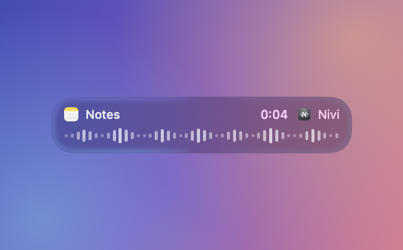
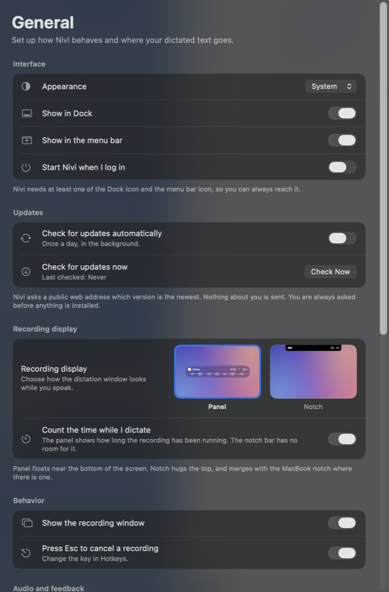
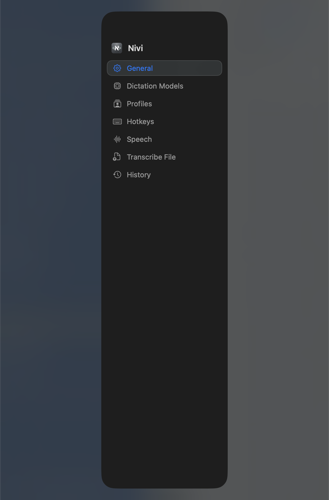

# Nivi

Nivi is a dictation app for macOS. You hold a hotkey, you speak, and the text
lands in whatever app you were already typing in. It runs Whisper models, so it
works in about a hundred languages, and you choose which model to use.

Hebrew gets a little extra attention, because that is what the author dictates
in. The ivrit-ai model is in the list and is the default, and it is a lot better
at Hebrew than the general models. Nothing else about the app is Hebrew specific.

Everything runs on your Mac. Your voice and your text are never sent to a
server, because there is no server.

The name comes from the Hebrew word *niv*, a turn of phrase. It is said
NEE-vee. The app was called Dictato until August 2026.



**Needs:** macOS 14 or newer, on an Apple Silicon Mac. Disk space for whichever
model you pick, downloaded on first launch. The large models are about 1.6 GB,
the small English one about 400 MB.

## What it does

- **A hotkey per language.** A profile ties one hotkey to one model and one
  language. Make one per language you dictate in, and the hotkey you press picks
  which one you get. Out of the box, double-tap right Command to start,
  single-tap to stop and paste, Esc to cancel.
- **Live modes.** Watch the words appear while you are still speaking, instead
  of waiting for the end.
- **Fast finish.** When you stop, Nivi only transcribes the part it has not
  already done, so the wait at the end is short even after a long stretch.
- **Transcribe a file.** Drop in an audio or video file and get the text back.
- **Local history.** Every dictation is kept on your Mac so you can find and
  copy something you said earlier. You choose how long it is kept.
- **Word replacements.** Names and terms the model keeps getting wrong can be
  fixed automatically, every time.
- **Microphone priority.** List the microphones you use in the order you prefer
  them. Nivi picks the first one that is plugged in, so moving between a headset
  and the built-in mic needs no thought.
- **Two recording displays.** A floating panel near the bottom of the screen, or
  a thin bar that merges with the MacBook notch.

<p>


</p>

## Privacy

- **No audio leaves your Mac.** Recording, transcription and pasting all happen
  locally, on the speech model on your disk.
- **No text leaves your Mac.** What you dictate goes to the clipboard and into
  the app you are using. Nowhere else.
- **History is a file on your disk**, under
  `~/Library/Application Support/Nivi/`. There is a retention setting in
  Preferences, and you can clear it whenever you like.
- **Two things do go over the network, both optional and neither about you.**
  Downloading a speech model from Hugging Face, once. And the daily update check,
  which fetches a public XML file and sends nothing about you. Both can be
  skipped, and the update check can be turned off in Preferences.

## Install

**[Download the latest version](https://github.com/Dvirco1234/nivi/releases/latest)**,
then read [INSTALL.md](INSTALL.md). The short version: open the DMG, drag Nivi to
Applications, get past one macOS warning, then grant three permissions.

Be warned about the first launch. Nivi is signed by its author, not by Apple, so
macOS blocks it once and says it "cannot be checked" or even that it is
"damaged". It is neither. Getting an app checked by Apple costs $99 a year, and
Nivi does not have that yet. INSTALL.md shows the fifteen seconds of clicking
that gets past it, and you only do it once.

## Build it yourself

You do not need Xcode. Command Line Tools and cmake are enough.

**1. Get the prerequisites.**

```sh
xcode-select --install     # Apple's Command Line Tools, if you do not have them
brew install cmake
```

**2. Clone the repo with its submodule.** whisper.cpp lives in
`vendor/whisper.cpp` as a git submodule, pinned to one exact commit.

```sh
git clone --recurse-submodules https://github.com/Dvirco1234/nivi.git
cd nivi
```

If you already cloned without `--recurse-submodules`, run
`git submodule update --init --recursive`. The `make vendor` step below does it
for you too.

**3. Build whisper.cpp.** This compiles the static libraries the app links
against, with Metal support. It takes a few minutes and only has to be done
once.

```sh
make vendor
```

**4. Create a signing identity.** One time, and it matters more than it looks.

```sh
make cert
```

This mints a self-signed certificate called "Nivi Self-Signed" in your login
keychain. macOS ties Accessibility, Input Monitoring and Microphone permission
to an app's signing identity, so signing ad-hoc would mint a new identity on
every build and silently drop all three. The Makefile refuses to build without
this certificate for exactly that reason.

**5. Build and run.**

```sh
make dev     # debug build, signed, installed to /Applications, relaunched
make app     # release build into build/Nivi.app, not installed
```

Always build through `make dev` or `make app`. A bare `swift build` refreshes
`.build/debug/Nivi` but leaves the copy inside the app bundle alone, so the app
you launch is the one you built last time.

**6. The first run asks for three permissions.** Nivi cannot work without them,
and macOS grants them per app, so a build of your own needs its own grants:

| Permission | What it is for |
|---|---|
| **Microphone** | Hearing you |
| **Accessibility** | Pasting into other apps, and noticing your hotkey |
| **Input Monitoring** | Noticing Esc when you cancel a recording |

Accessibility and Input Monitoring look like the same thing and are two separate
switches. If your hotkey works but Esc does nothing, Input Monitoring is the one
that is off.

**7. On first launch** the app downloads the model you picked. After that it
never needs the network again.

### Tests

They run without full Xcode:

```sh
bash Tools/run-core-tests.sh   # prints ALL CORE CHECKS PASSED
```

### Releasing

```sh
make release VERSION=0.2.0
```

One command: builds the app, packs the DMG, signs and updates the Sparkle feed,
uploads, tags and pushes. `make dist` does the same without git or publishing.
See [docs/release-pipeline.md](docs/release-pipeline.md).

### Design notes and research

`docs/` also holds the notes written while building the app. They are kept
because the reasoning is often more useful than the result.

| Folder | What is in it |
|---|---|
| [docs/superpowers/](docs/superpowers/) | Design specs and implementation plans, one per milestone |
| [docs/streaming/](docs/streaming/) | How to finish a transcription fast without losing accuracy |
| [docs/parakeet/](docs/parakeet/) | Review of the Parakeet model as a whisper.cpp alternative |
| [docs/ios/](docs/ios/), [docs/mobile/](docs/mobile/) | Whether dictation on iPhone and Apple Watch is feasible, and which models fit |
| [docs/ui/](docs/ui/) | The Preferences redesign plan |
| [docs/naming/](docs/naming/) | How the name Nivi was picked |

## Where things are kept

| What | Where |
|---|---|
| Settings | the `com.dvir.nivi` defaults domain |
| Models, history, layout tuning | `~/Library/Application Support/Nivi/` |
| Logs | `~/Library/Logs/Nivi/nivi.log` |

Settings can be changed from the Terminal too, with
`defaults write com.dvir.nivi <key> <value>`. Everything in Preferences is one
of these keys; `Sources/NiviCore/Settings.swift` is the full list.

## Coming from Dictato

The first launch under the new name brings the old data across by itself: the
settings are copied out of `com.dvir.dictato`, and
`~/Library/Application Support/Dictato/` is renamed to `.../Nivi/`, so the
downloaded models are not fetched again.

Two things it cannot bring across:

- **Permissions.** macOS ties them to the app's identity, and Nivi is a new
  identity, so Microphone, Accessibility and Input Monitoring must be granted
  again. See [INSTALL.md](INSTALL.md).
- **The old app.** `/Applications/Dictato.app` is still there. Delete it once
  Nivi is working, and remove the leftover Dictato rows from Login Items and
  from the Privacy & Security lists.

## Built on other people's work

Nivi would not exist without these. Each one is used under a permissive licence
that allows commercial use and redistribution.

| Project | What it does here | Licence |
|---|---|---|
| [whisper.cpp](https://github.com/ggml-org/whisper.cpp) | Runs the speech model on Metal. Vendored as a submodule. | [MIT](https://github.com/ggml-org/whisper.cpp/blob/master/LICENSE) |
| [Sparkle](https://github.com/sparkle-project/Sparkle) | The self-update mechanism | [MIT](https://github.com/sparkle-project/Sparkle/blob/2.x/LICENSE), with BSD 2-Clause and zlib parts inside it |
| [ivrit-ai/whisper-large-v3-turbo-ggml](https://huggingface.co/ivrit-ai/whisper-large-v3-turbo-ggml) | A Whisper fine-tune for Hebrew. The default model. | Apache 2.0 |
| [OpenAI Whisper](https://huggingface.co/openai/whisper-large-v3-turbo) | The model everything above is fine-tuned from | MIT |
| [ggerganov/whisper.cpp models](https://huggingface.co/ggerganov/whisper.cpp) | The multilingual and English-only models in the catalogue | MIT |

Two notes worth spelling out:

- **The models are downloaded, not shipped.** Nivi fetches them from Hugging
  Face on demand. No model weights are in this repo or in the DMG.
- **ivrit-ai's training data is more restricted than their model.** The
  [ivrit.ai data licence](https://www.ivrit.ai/en/the-license/) is CC BY 4.0 plus
  extra terms: the data may only be used for training AI models or academic
  research, and may not be used to fake anyone's voice. Those terms are about the
  audio and transcripts, which Nivi never touches. The published weights are
  Apache 2.0, which is ivrit-ai's own choice about their own work.

## Licence

MIT. See [LICENSE](LICENSE).

Copyright (c) 2026 Dvir Cohen.
